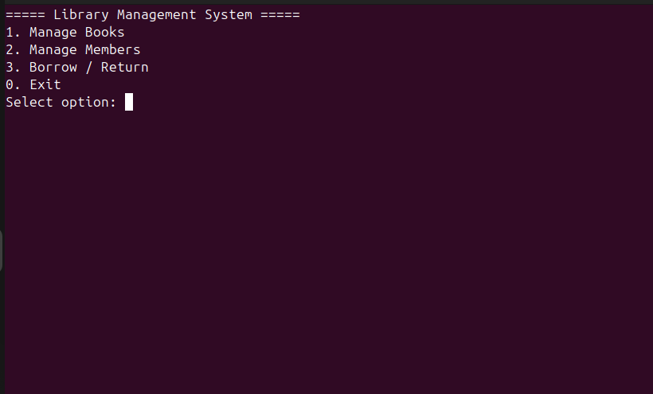

# Library Management System

## Description

- This is a library management system written in C# using .NET Core and NUnit with a focus on Test Driven Development (TDD).

## Demo



## TDD Steps

1. RED - Tests must fail
2. GREEN - Tests must pass with minimal code as possible
3. REFACTOR - Refactor code such that all tests pass and the code is readable and maintainable

## Project info

### Features

1. Add Book
2. List Books
3. Search Book
4. Remove Book
5. Register Member
6. List Members
7. Borrow Book
8. Return Book
9. Show Borrowed Books
10. Show Member's Borrowed Books

## Steps to re-create project

1. Make directory `LibraryManagementSystem`

```bash
mkdir LibraryManagementSystem
cd LibraryManagementSystem
```

2. Generate solution file

```bash
dotnet new sln
```

3. Create a new project

```bash
dotnet new console -n LibraryManagementSystem.App
```

4. Add project to solution

```bash
dotnet sln add LibraryManagementSystem.App/LibraryManagementSystem.App.csproj
```

5. Create test project

```bash
dotnet new nunit -n LibraryManagementSystem.Tests
```

6. Add test project to solution

```bash
dotnet sln add LibraryManagementSystem.Tests/LibraryManagementSystem.Tests.csproj
```

7. Make the test project be able to reference the main project

```bash
dotnet add LibraryManagementSystem.Tests/LibraryManagementSystem.Tests.csproj reference LibraryManagementSystem.App/LibraryManagementSystem.App.csproj
```

## Steps to run project

1. Run the project

```bash
dotnet run --project LibraryManagementSystem.App/LibraryManagementSystem.App.csproj
```

2. Run the tests

```bash
dotnet test LibraryManagementSystem.Tests/LibraryManagementSystem.Tests.csproj
```
